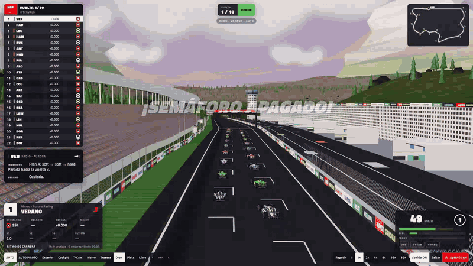
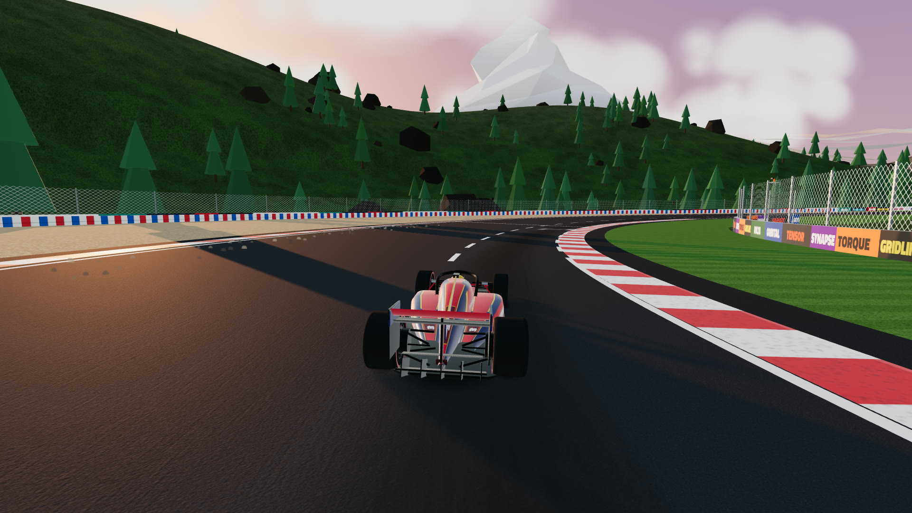
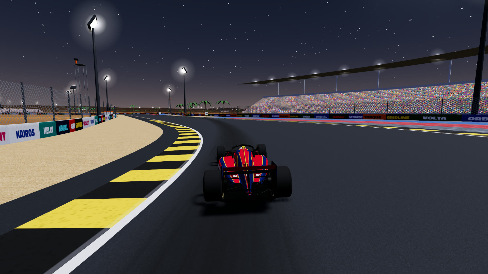
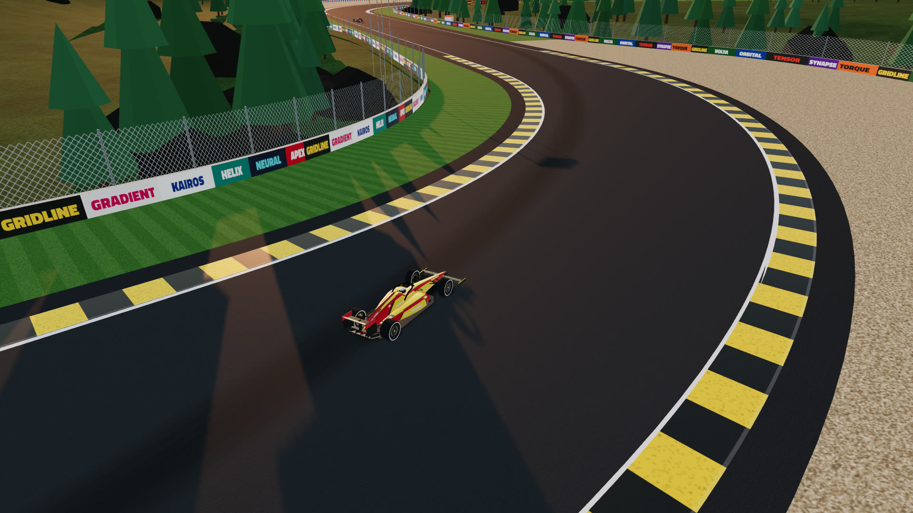
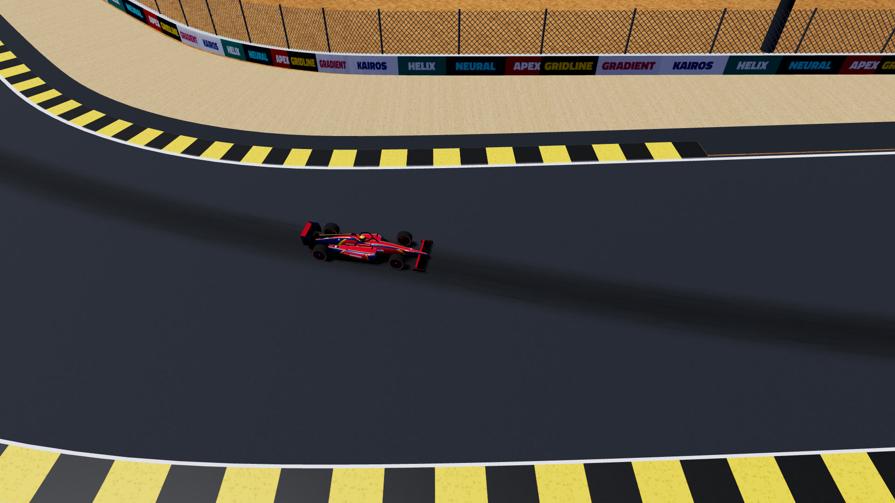
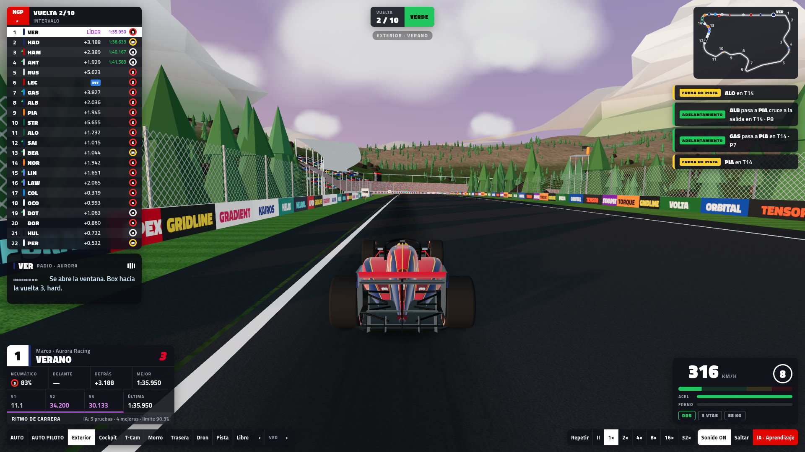
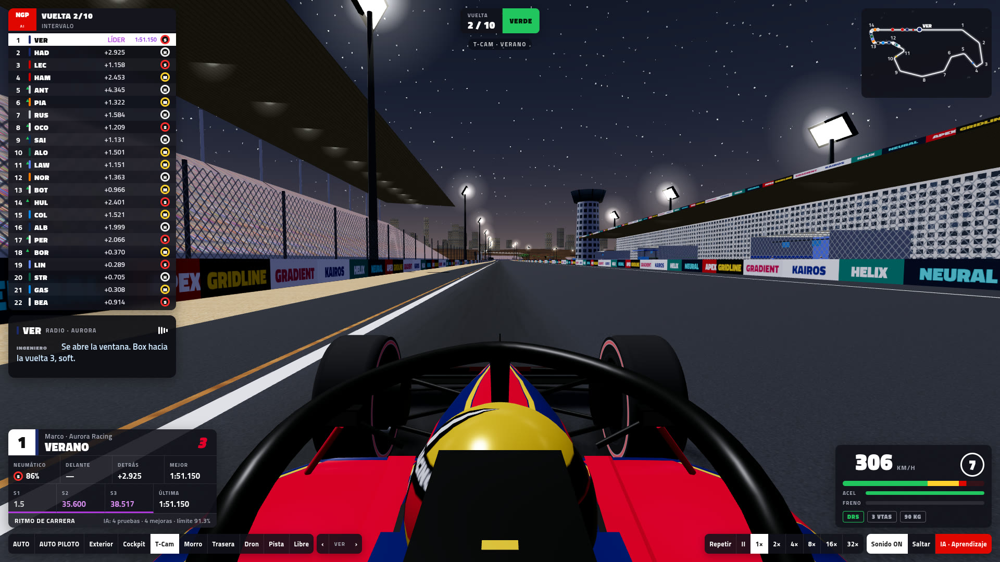
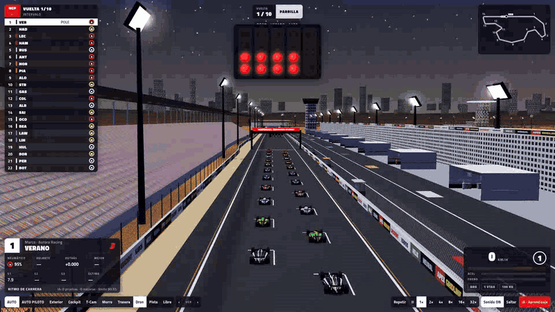
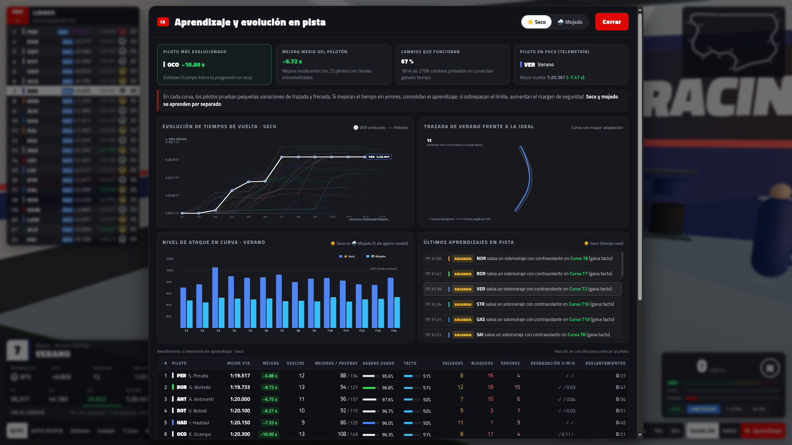

# Neural Grand Prix

Veintidós pilotos con IA que aprenden a correr. Fin de semana completo: libres → Q1/Q2/Q3 → carrera,
con paradas, estrategia de neumáticos, lluvia, radio y realización de TV. Hecho con three.js, sin build.

| | |
|---|---|
|  |  |
|  |  |
|  |  |

**Panel de aprendizaje** (tecla L): quién mejora más, evolución de tiempos, trazada frente a la ideal y agarre que se atreve a usar en cada curva.

## Circuitos

Se elige en la pantalla de inicio:

- **Neural Park**: permanente, de día, 5,2 km, escapatorias de grava y hierba.
- **Porto Cidade**: urbano, 5,4 km de calles en ángulo recto, muros a 2 m, puerto con yates.
- **Al Noor**: desierto de noche con torres de focos, 6 km, hotel iluminado.
- **Monte Alto**: montaña al atardecer, con desniveles fuertes.

Cada circuito guarda por separado lo que aprenden los pilotos.

## Jugar

    ./jugar.sh            # abre http://localhost:8765/

Opciones por URL: `?q=low` (calidad baja), `?laps=10`, `?track=gp|urban|night|mount`, `?wx=dry|mixed|wet`, `?start=Q1`.

## Controles

| Tecla | Acción |
|---|---|
| A | realización automática on/off |
| P | automática pegada al piloto elegido (solo cambia de plano) |
| 1–8 | Exterior, Cockpit, T-Cam, Morro, Trasera, Heli, Pista, Libre |
| ← → / [ ] | piloto anterior / siguiente (o clic en la torre) |
| Espacio | pausa · `+`/`−` velocidad |
| L | panel de aprendizaje · M sonido · H ocultar HUD |

## Física (js/sim.js)

Coche con elipse de agarre (frenar y girar a la vez se reparten el agarre), dirección que persigue un punto
de su trazada y derrape de la trasera que el piloto caza con contravolante (mejor cuanto más constante es).
Los errores no son dados al azar: salen de apretar más de lo que da el coche (compromiso aprendido,
aire sucio, gomas frías, variación de cada entrada); se abren, se salen, trompean o tocan el muro.

## Qué aprende cada piloto (js/brain.js)

- **Trazada**: nodos laterales cada 20 m; en cada curva prueba una variación y se la queda si la curva le sale más rápida sin error.
- **Límite**: % del agarre que se atreve a usar por curva; sube explorando, baja al equivocarse.
- **Degradación** por compuesto medida en tandas largas → decide la estrategia de carrera.
- **Adelantamientos**: en qué curvas le salen (se atreve más donde ha tenido éxito).

Se guarda en `localStorage` y continúa el siguiente fin de semana.

## Estructura

`track.js` circuito · `sim.js` física, pelea en pista, boxes, sesiones · `brain.js` aprendizaje ·
`carModel.js` monoplaza · `world.js` pista y boxes · `scenery.js` alrededores · `director.js` cámaras ·
`decor.js` ciudad, puerto y focos · `ui.js` HUD · `audio.js` motor · `tools/` simulación sin gráficos para calibrar
(`node tools/weekend.mjs track=urban`, `tools/slide.mjs`, `tools/overtakes.mjs`, `tools/tracks.mjs`).
